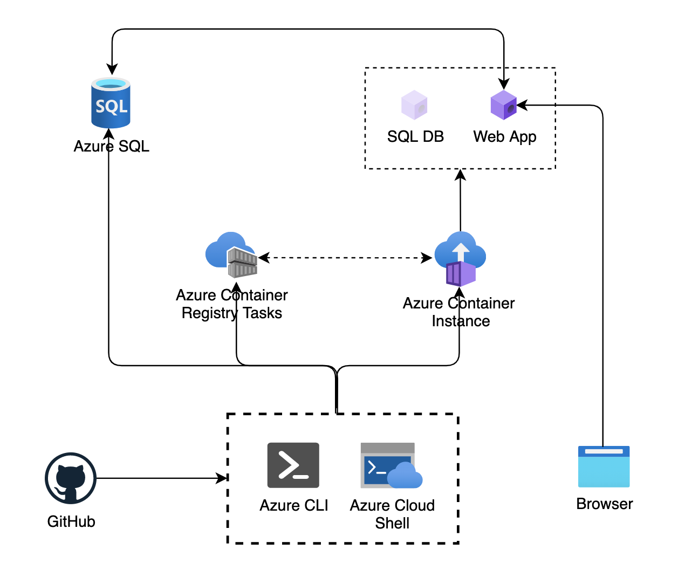

# Challenge 3 - Move to Azure SQL Database

## Prerequisities

1. [Challenge 2 - Run the app](./RunTheApp.md) should be done successfuly.

## Introduction

So far we have deployed a SQL Server on Linux containers which was really convenient for dev/test scenarios, especially locally. But now with this challenge we would like to leverage Azure SQL Database as a Platform-as-a-Service (PaaS) which offers out-of-the-box features for Production: security patch, SQL Server upgrades, Auto-tuning, Geo-replication, Scaling up or down the size of the server, etc. that we don't want to do by ourself.

## Challenges

1. Provision your Azure SQL Database via Infrastructure-as-Code from within Azure Cloud Shell. The approach here is to leverage the Azure CLI (not the Azure portal) by executing a series of bash commands. *Friends don't let friends use UI to provision Azure services, right? ;)*
1. Update your app (re-build and re-deploy the Docker image) with the new connection string (as environment variable), test the app as an end-user, and play a game once deployed there.

## Success criteria

1. In Azure Cloud Shell, make sure `az sql server list` and `az sql db list` are showing your Azure services properly.
1. In Azure Cloud Shell, do a `docker rm` of your SQL Server on Linux container.
1. In your web browser, navigate to the app and play a game, make sure it's working without any error.
1. In GitHub, make sure you documented the different commands you have used to update or provision your infrastructure. It could be in a `.md` file or in `.sh` file. You will complete this script as you are moving forward with the further challenges.
   1. Be sure you don't commit any secrets/passwords into a public GitHub repo.
1. In Azure DevOps (Boards), from the Boards view, you could now drag and drop the user story associated to this Challenge to the `Resolved` or `Closed` column, congrats! ;)

## Tips

1. [Azure SQL Database Service CLI documentation](https://docs.microsoft.com/en-us/cli/azure/sql/db), [here are some snippets you could leverage](https://docs.microsoft.com/en-us/azure/sql-database/scripts/sql-database-create-and-configure-database-cli).
1. You could execute the `git` commands "locally" from within your Azure Cloud Shell, or you could leverage the web editor directy from GitHub.

## Advanced challenges

Too comfortable? Eager to do more? Try this:

1. Instead of leveraging Azure CLI to provision your infrastructure, you could leverage instead Azure ARM Templates, Ansible for Azure or Terraform for Azure.

## Learning resources

- [Choose between SQL Server (IaaS) or Azure SQL Database (PaaS)](https://docs.microsoft.com/en-us/azure/sql-database/sql-database-paas-vs-sql-server-iaas)
- [Why switch to SQL Server 2017 on Linux?](https://info.microsoft.com/top-six-reasons-companies-make-the-move-to-sql-server-2017-register.html)
- [Azure CLI](https://docs.microsoft.com/en-us/cli/azure)
- [Azure ARM Templates](https://docs.microsoft.com/en-us/azure/azure-resource-manager/)
- [Ansible for Azure](https://docs.microsoft.com/en-us/azure/ansible/)
- [Terraform for Azure](https://docs.microsoft.com/en-us/azure/terraform/)

[Next challenge (Run the app on Azure) >](./RunOnAzure.md)
