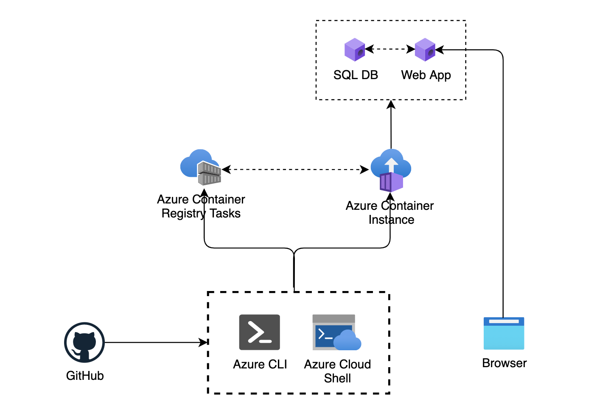

# Challenge 2 - Run the app

## Prerequisites

1. [Challenge 1 - Setup](./Setup.md) should be done successfully.

## Introduction

With this second challenge you will be able to run "locally" in your Azure Cloud Shell the given "Rock Paper Scissors Boom" app.

## Challenges

1. Leveraging Azure Container Instance, build and run the app from within Azure Cloud Shell. You can use the `deploy-aci.yaml` file we have provided in /WhatTheHack/005-RockPaperScissorsBoom/Student/Resources/Code.
     * See **Tips** below for an example of how to do this.

2. Test the app as an end-user, and play a game. You can reach the app via the dockerhost's public IP address. Try `az container show` to find the IP address or FQDN of your ACI deployment. Or, look for it in the portal.

## Success criteria

1. In Azure Cloud Shell, make sure `az acr repository list` is showing your image.
2. In Azure Cloud Shell, make sure `az container show` is reporting 2 Docker containers.
3. In your web browser, navigate to the app and play a game, make sure it's working without any error.
4. In Azure Cloud Shell, read the `deploy-aci` file and the `Dockerfile-*` files. What do you see? What do you understand? Are you able to quote 3 benefits/advantages of using Docker?
5. In Azure DevOps (Boards), from the Boards view, you could now drag and drop this user story associated to this Challenge to the `Resolved` or `Closed` column, congrats! ;)

## Tips

1. Azure CLI is your friend, look at [Deploying multi-container group using a YAML file](https://docs.microsoft.com/azure/container-instances/container-instances-multi-container-yaml) to see how it can help with the challenge
2. To edit or read files from within Azure Cloud Shell, you could run `code .` to graphically browse the current folder and its files and subfolders. FYI, `cat` or `vi` are other alternatives.

## Advanced challenges

Too comfortable? Eager to do more? Try this:

1. Instead of leveraging Azure ACI via Azure Cloud Shell, you could configure your local machine with Visual Studio Code, or Visual Studio, installed .NET Core and deploy your app locally, alternatively, you could install Docker Desktop to run your local environment.

## Learning resources

- [SQL Server on Linux](https://docs.microsoft.com/en-us/sql/linux/sql-server-linux-overview)
- [ASP.NET Core](https://docs.microsoft.com/en-us/aspnet/core)
- [Why Docker?](https://www.docker.com/)

[Next challenge (Move to Azure SQL Database) >](./MoveToAzureSql.md)
